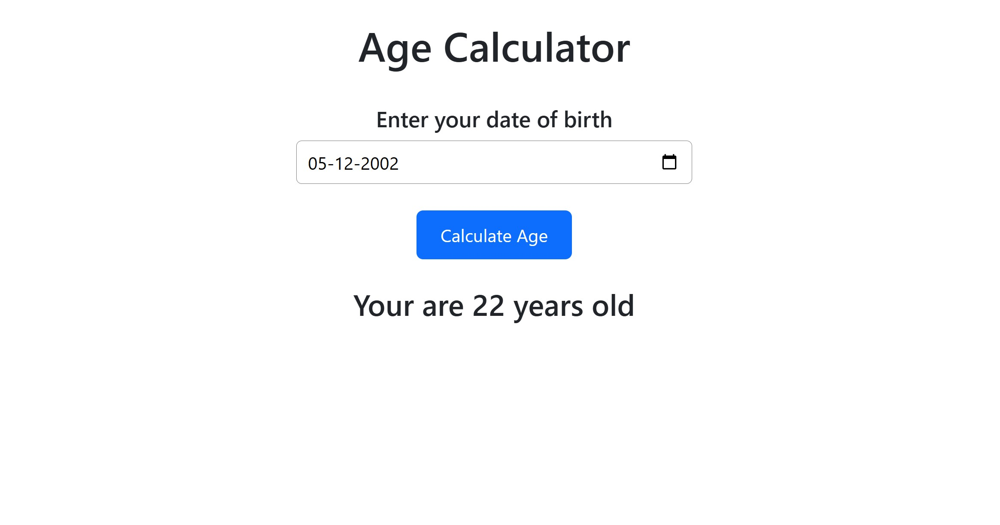

# 🎂 Age Calculator (React)

A simple and interactive age calculator built with React. This application calculates your age in years, months, and days based on the date of birth you provide. Built as part of a React learning task to practice working with dates and form inputs.

🔗 **Live Demo:** [https://task-5-react-js.vercel.app/](https://task-5-react-js.vercel.app/)

---

## 🚀 Features

- Input your date of birth and get your exact age  
- Calculates years, months, and days  
- Clean and responsive user interface  
- Built using React functional components and hooks  

---

## 📸 Screenshots

### 🏠 Home Page

This is the initial view of the app when loaded.



---

## ⚙️ Tech Stack

- ReactJS  
- HTML5 & CSS3  
- JavaScript (ES6)  
- Date manipulation using native JS

---

## 📦 Installation & Setup

1. **Clone the repository:**
   ```bash
   git clone https://github.com/yaswantharao05/Age-Calculator-React.git
   cd age-calculator-react
